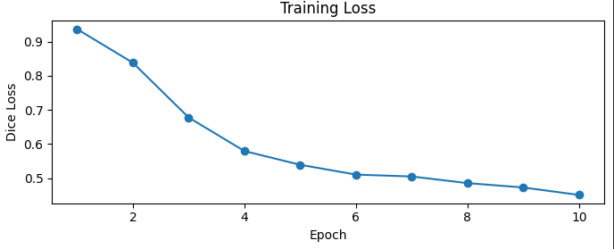
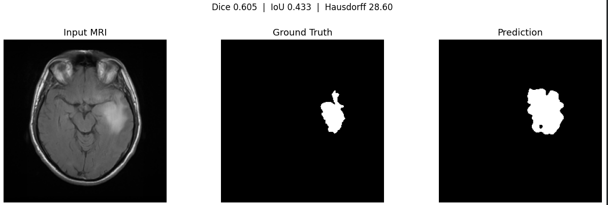

# U-Net

## Overview

This experiment was performed without data augmentation.  An additional experiment with data augmentation is planned and its results will be added soon.

Additionally, a few modifications were made to the original U-Net architecture:
- Padding was added to convolution layers
- This avoided feature map cropping during skip connections
- Spatial dimensions were preserved throughout the network

The implementation was evaluated using:
- Dice Score
- Intersection over Union (IoU)
- Hausdorff Distance

---

## Configuration

```python
IMAGE_DIR   = 'data/images'
MASK_DIR    = 'data/masks'

IMG_SIZE    = 256
BATCH_SIZE  = 4

EPOCHS      = 10
LR          = 1e-4

IN_CHANNELS = 1
NUM_CLASSES = 1
```

---

## Evaluation Metrics

- **Dice Score**: Measures the overlap similarity between the predicted segmentation mask and the ground truth mask.

- **Intersection over Union (IoU)**: Measures the ratio of overlapping area to the total combined area of prediction and ground truth.

- **Hausdorff Distance**: Measures the maximum boundary distance between the predicted mask and the ground truth mask.

---

## Loss Curve without Augmentation



---

## Segmentation Result



## References:
This was possible because of:

1. [Alladin Persson - UNET](https://www.youtube.com/watch?v=IHq1t7NxS8k&t=1841s)

---